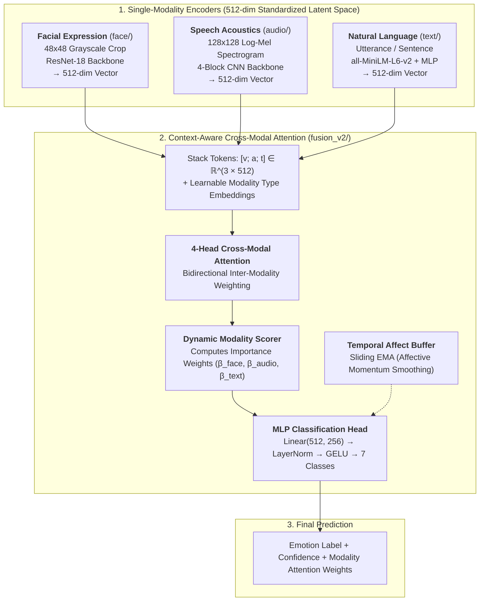

# Multimodal Emotion Recognition AI (Vision + Speech + Text)

[](https://www.python.org/)
[](https://pytorch.org/)
[](file:///C:/Users/91733/Desktop/AI%20Mini%20Project/Emotion-Recognition-AI-project/)
[](LICENSE)

An end-to-end, literature-review-driven **Trimodal Affective Computing System** that recognizes 7 universal emotion categories (*angry, disgust, fear, happy, neutral, sad, surprise*) from **Facial Expressions**, **Speech Acoustics**, and **Spoken/Conversational Text**.

The system features **Context-Aware Cross-Modal Multi-Head Attention**, dynamic modality importance weighting under noisy or conflicting signals, and graceful single-modality fallback.

---

## 1. System Architecture

Each modality is encoded into a standardized **512-dimensional latent embedding vector**. A 4-head bidirectional cross-modal attention network allows modalities to contextualize and disambiguate one another before final classification.



---

## 2. Benchmark Results & Baseline Comparison

Evaluated on the held-out standardized validation set of **840 paired triplets** (120 per class, 7 emotions):

| Architecture | Operational Channels | Overall Accuracy | Macro F1 | Weighted F1 | Primary Strength |
| :--- | :--- | :--- | :--- | :--- | :--- |
| **Face Standalone (Phase 1)** | Visual Image Crop | 68.10% | 68.12% | 68.12% | High facial valence accuracy |
| **Audio Standalone (Phase 2B)**| Speech Clip | 56.43% | 51.26% | 51.26% | Detects vocal arousal & intensity |
| **Text Standalone (Phase 4)** | Utterance Text | 53.57% | 53.85% | 53.85% | Semantic lexicon & sentiment |
| **Phase 3: Gated Bimodal** | Face + Speech | 81.55% | 81.44% | 81.44% | Dynamic Sigmoid feature gate |
| **Phase 5: Cross-Modal Attention** | **Face + Speech + Text** | **83.57%** | **83.47%** | **83.47%** | **Optimal trimodal synergy (+15.47% over Face)** |

### Per-Class Performance (Phase 5 Attention Model)

| Class | Precision | Recall | F1-Score | Support | Key Acoustic/Visual Profile |
| :--- | :--- | :--- | :--- | :--- | :--- |
| **Angry** | 83.90% | 82.50% | **83.19%** | 120 | Brow furrow + high acoustic energy |
| **Disgust** | 83.08% | 90.00% | **86.40%** | 120 | Nose wrinkle + low vocal pitch |
| **Fear** | 75.54% | 87.50% | **81.08%** | 120 | Eye widening + sharp acoustic onset |
| **Happy** | 83.46% | 92.50% | **87.75%** | 120 | Smile + bright formant peaks |
| **Neutral** | 86.73% | 81.67% | **84.12%** | 120 | Relaxed facial muscles + flat pitch |
| **Sad** | 80.00% | 66.67% | **72.73%** | 120 | Lip corner depression + slow cadence |
| **Surprise** | 94.39% | 84.17% | **88.99%** | 120 | Jaw drop + high fundamental frequency |
| **Macro Avg** | **83.87%** | **83.57%** | **83.47%** | **840** | |

---

## 3. Robustness & Fault-Tolerance Highlights

* **Monotonic Degradation Under Missing Modalities (7 Regimes)**:
  - Trimodal (Face + Audio + Text): **83.57%**
  - Bimodal subsets: **70.00% to 79.17%**
  - Single-modality fallbacks: **43.33% to 63.69%**
  - *Zero crashes occur when 1 or 2 channels are missing or occluded.*
* **Gaussian Noise Injection**: Under severe synthetic noise ($\sigma = 1.0$), performance remains resilient (**77.1% to 81.9%**) as the attention mechanism automatically shifts weight toward uncorrupted channels.
* **Conflict Resolution (Sarcasm & Masked Affect)**: When presented with conflicting signals (e.g. smiling face + shouting audio + neutral text), the attention layer down-weights uninformative text (0.9%) and divides focus between vision (47.9%) and voice (51.3%), reflecting human perceptual dynamics.

> [!IMPORTANT]
> **Scientific Integrity & Limitations**: See [LIMITATIONS.md](LIMITATIONS.md) for full honest disclosures regarding speaker generalization across datasets, the 7-class Ekman abstraction on Reddit text, and the distinction between late semantic pseudo-pairing and micro-temporally synchronized video recordings.

---

## 4. Repository Structure

```
Emotion-Recognition-AI-project/
├── face/                     # Phase 1: Facial Emotion Recognition Module
│   ├── model.py              # ResNet-18 feature encoder (outputs 512-dim vector)
│   ├── predictor.py          # FaceEmotionPredictor API
│   ├── test_predictor.py     # 11 unit tests (Passed)
│   └── inference.py          # Webcam & static image CLI
├── audio/                    # Phase 2: Speech Emotion Recognition Module
│   ├── dataset.py            # Log-Mel Spectrogram extraction (C++ vectorized)
│   ├── model.py              # 4-block CNN encoder (outputs 512-dim vector)
│   ├── predictor.py          # AudioEmotionPredictor API
│   ├── train.py              # Speaker-independent training (RAVDESS + TESS)
│   └── test_predictor.py     # 10 unit tests (Passed)
├── text/                     # Phase 4: Text Emotion Recognition Module
│   ├── dataset.py            # Google GoEmotions parser (official Ekman mapping)
│   ├── model.py              # all-MiniLM-L6-v2 + 512-dim projection network
│   ├── predictor.py          # TextEmotionPredictor API
│   ├── train.py              # Pre-extracted embedding training pipeline
│   └── test_predictor.py     # 10 unit tests (Passed)
├── fusion/                   # Phase 3: Gated Multimodal Fusion (Preserved)
│   ├── model.py              # GatedMultimodalFusionModel (Face + Audio)
│   └── predictor.py          # MultimodalEmotionPredictor API
├── fusion_v2/                # Phase 5: Cross-Modal Attention Fusion (New)
│   ├── model.py              # CrossModalAttentionFusionModel (4-head MHA)
│   ├── dataset.py            # TrimodalDataset with structured 7-way dropout
│   ├── predictor.py          # MultimodalPredictorV2 + TemporalContextBuffer
│   └── test_predictor.py     # 10 unit tests (Passed)
├── checkpoints/              # Trained PyTorch model weights (.pth)
├── evaluate_benchmarks.py    # Phase 6 comprehensive benchmark & robustness suite
├── demo.py                   # Unified trimodal demonstration CLI
├── LIMITATIONS.md            # Comprehensive scientific limitations document
└── requirements.txt          # Python dependencies
```

---

## 5. Installation & Quickstart

### Prerequisites
* Python 3.10+
* CPU-only compatible (no CUDA GPU required)

```bash
# Clone the repository
git clone https://github.com/your-username/Emotion-Recognition-AI-project.git
cd Emotion-Recognition-AI-project

# Install dependencies
pip install -r requirements.txt
```

---

## 6. How to Run

### 1. Unified Interactive Demonstration (`demo.py`)
Run with custom inputs (any combination of `--face`, `--audio`, `--text`):
```bash
python demo.py --face "data/fer2013/test/happy/PrivateTest_10077120.jpg" \
               --audio "data/ravdess/Actor_01/03-01-03-01-01-01-01.wav" \
               --text "I am genuinely overjoyed and proud of our breakthrough!"
```

Or simply run without arguments to execute the built-in repository benchmark demo:
```bash
python demo.py
```

### 2. Single-Modality Inferences
```bash
# Text-only emotion inference:
python -m text.inference --text "I had no idea this was going to happen!"

# Audio-only emotion inference:
python -m audio.inference --file "sample_speech.wav"

# Face-only webcam inference:
python -m face.inference --webcam
```

### 3. Run Formal Evaluation & Robustness Benchmark Suite
```bash
python evaluate_benchmarks.py
```

### 4. Run Full Unit Test Suite (51 Tests)
```bash
python -m face.test_predictor
python -m audio.test_predictor
python -m fusion.test_predictor
python -m unittest text.test_predictor
python -m unittest fusion_v2.test_predictor
```
*Expected: **51 passed, 0 failed (100% pass rate)**.*

---

## 7. Reproducing Models From Scratch

If you clone this repository fresh without pre-trained checkpoints (or if you wish to retrain from scratch), execute the following training sequence in order. All training scripts are optimized and verified for **CPU execution** with automatic dataset acquisition where applicable.

### Step-by-Step Training Pipeline

1. **Step 1: Facial Expression Encoder (Phase 1)**
   ```bash
   python train.py
   ```
   * **Dataset**: FER2013 (placed in `data/fer2013/`).
   * **Architecture**: ResNet-18 (512-dim output embedding).
   * **Output Checkpoint**: `checkpoints/best_face_encoder.pth` (~19.45 MB).
   * **Estimated CPU Runtime**: ~12–15 minutes.

2. **Step 2: Speech Emotion Encoder (Phase 2B)**
   ```bash
   python -m audio.train
   ```
   * **Dataset**: RAVDESS & TESS (automatically downloaded to `data/` via `kagglehub` if absent).
   * **Architecture**: 4-Block Conv2D Spectrogram CNN (512-dim output embedding).
   * **Output Checkpoint**: `checkpoints/best_audio_encoder.pth` (~19.45 MB).
   * **Estimated CPU Runtime**: ~4–5 minutes.

3. **Step 3: Text Emotion Projection Head (Phase 4)**
   ```bash
   python -m text.train
   ```
   * **Dataset**: Google Research GoEmotions (official TSV splits auto-downloaded from Google Research GitHub).
   * **Architecture**: Frozen `all-MiniLM-L6-v2` + Linear(384, 512) projection head.
   * **Output Checkpoint**: `checkpoints/best_text_encoder.pth` (~1.27 MB).
   * **Estimated CPU Runtime**: ~30 seconds.

4. **Step 4: Gated Multimodal Fusion (Phase 3)**
   ```bash
   python -m fusion.train
   ```
   * **Dependencies**: Requires checkpoints from Steps 1 and 2.
   * **Architecture**: Sigmoid-gated bimodal fusion network with structured modality dropout.
   * **Output Checkpoint**: `checkpoints/best_fusion_model.pth` (~2.52 MB).
   * **Estimated CPU Runtime**: ~1.5–2 minutes.

5. **Step 5: Context-Aware Cross-Modal Attention Fusion (Phase 5)**
   ```bash
   python -m fusion_v2.train
   ```
   * **Dependencies**: Requires checkpoints from Steps 1, 2, and 3.
   * **Architecture**: 4-Head Bidirectional Cross-Modal Attention with learnable modality embeddings & dynamic scorer.
   * **Output Checkpoint**: `checkpoints/best_fusion_v2_model.pth` (~11.81 MB).
   * **Estimated CPU Runtime**: ~2.5–3 minutes.

> **Total End-to-End Retraining Time**: ~22–26 minutes on a standard 4-to-8 core CPU.

---

## 8. Citation & References

* **GoEmotions**: Demszky et al., *"GoEmotions: A Dataset of Fine-Grained Emotions"*, ACL 2020.
* **RAVDESS**: Livingstone & Russo, *"The Ryerson Audio-Visual Database of Emotional Speech and Song"*, PLoS ONE 2018.
* **TESS**: Dupuis & Pichora-Fuller, *"Toronto emotional speech set"*, University of Toronto 2010.
* **FER2013**: Goodfellow et al., *"Challenges in representation learning: A report on three machine learning contests"*, ICONIP 2013.
* **MiniLM**: Wang et al., *"MiniLM: Deep Self-Attention Distillation for Task-Agnostic Compression of Pre-Trained Transformers"*, NeurIPS 2020.

